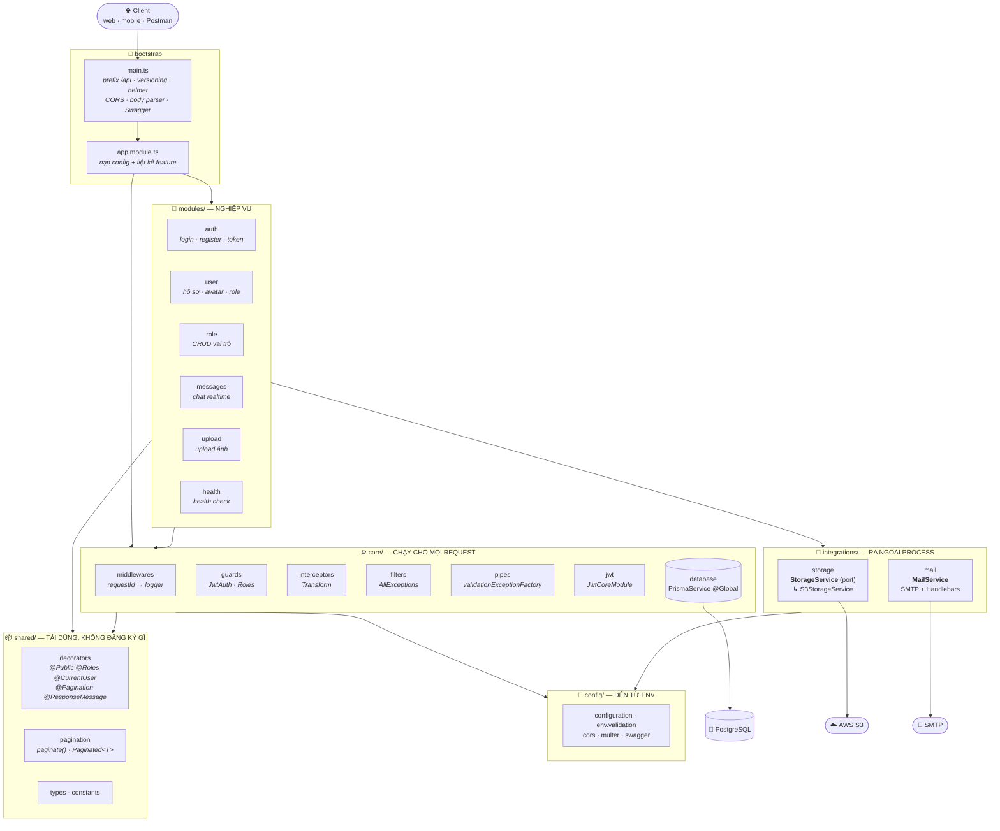
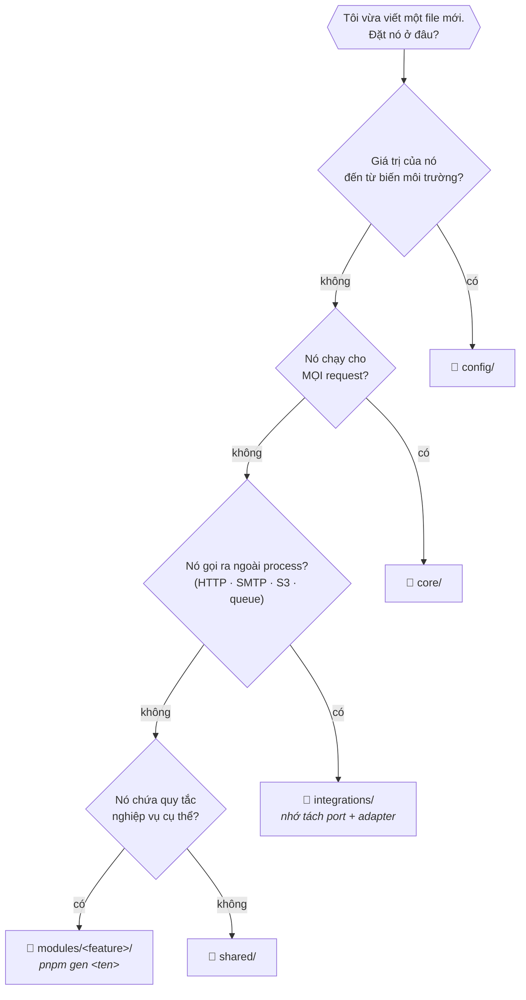
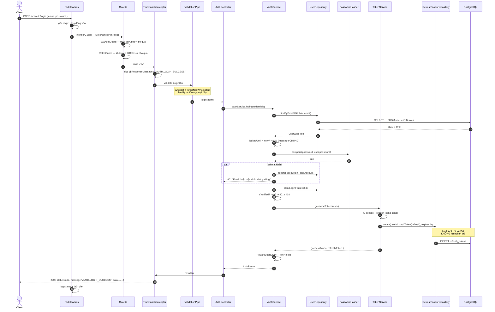
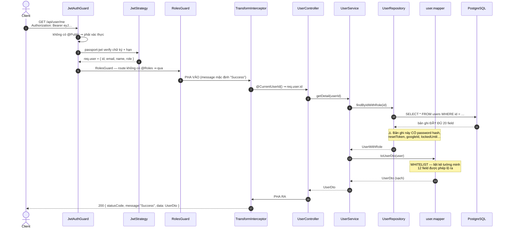
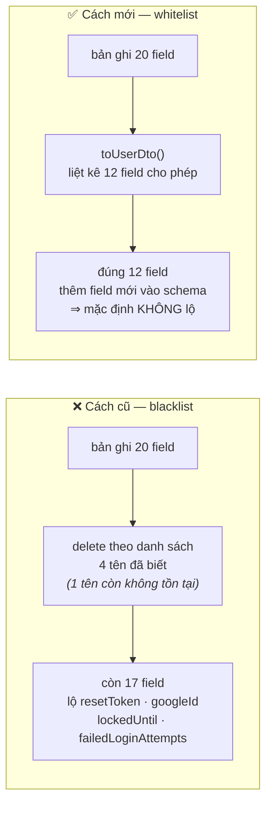
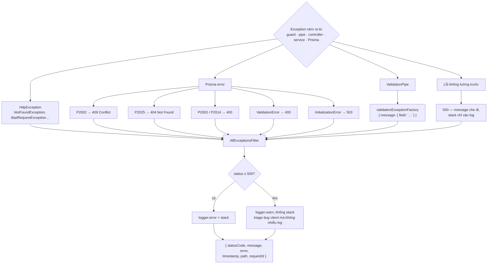
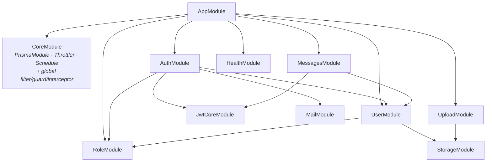
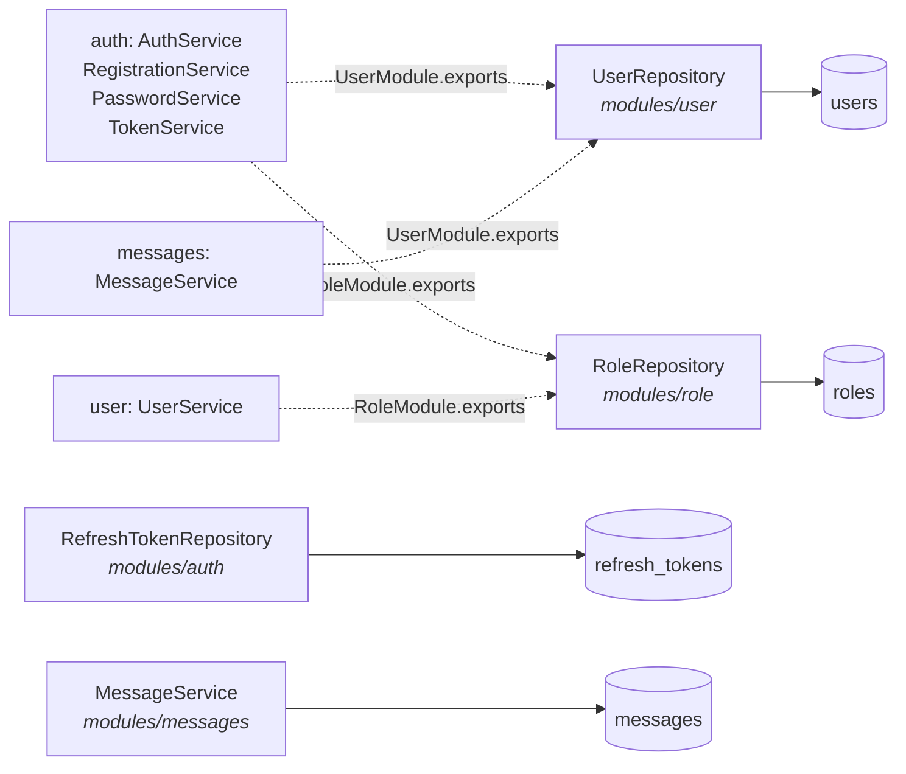
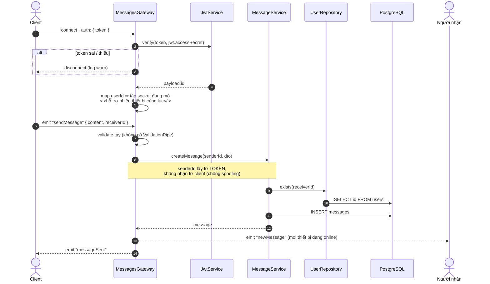
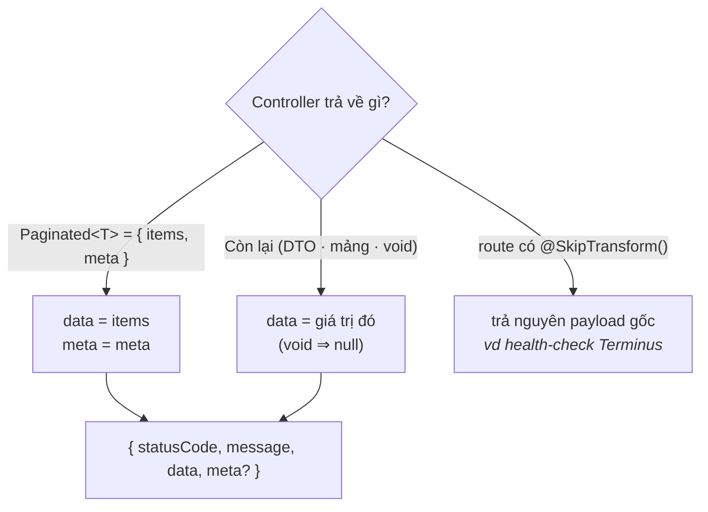

# 🗺️ Sơ đồ kiến trúc & Luồng request

> Mọi sơ đồ dưới đây vẽ theo **code thật** trong repo (không phải mô hình lý thuyết).
> Mỗi hộp đều kèm file tương ứng để bấm thẳng vào.
>
> Liên quan: [ARCHITECTURE.md](./ARCHITECTURE.md) · [CODING_STANDARDS.md](./CODING_STANDARDS.md)

---

## 1. Bản đồ tổng thể — 4 tầng



### Quy tắc phụ thuộc — mũi tên CHỈ đi một chiều

```
modules/  ──▶  integrations/  ──▶  config/
   │                                  ▲
   ├──────▶  core/  ──────────────────┤
   │           │                      │
   └──────▶  shared/  ────────────────┘
```

| ❌ Cấm | Vì sao |
|---|---|
| `core/` · `shared/` · `integrations/` import `modules/` | Xoá một feature không được làm vỡ hạ tầng |
| `shared/` import `core/` hoặc `integrations/` | `shared/` là tầng đáy, phải dùng lại được ở mọi nơi |
| Trong `modules/`: import bằng `../../…` | Ẩn mất phụ thuộc; bắt buộc dùng alias `@/…` |

Cả 4 quy tắc được **ESLint chặn** ([.eslintrc.js](../.eslintrc.js)) → vi phạm là fail CI, không phụ thuộc trí nhớ reviewer.

---

## 2. Đặt file mới ở đâu? — cây quyết định



---

## 3. Vòng đời một HTTP request

Thứ tự thật của NestJS. Chú ý **interceptor bọc hai đầu** quanh pipe + controller —
đây là chỗ hay bị vẽ sai thành "interceptor chạy sau controller".

```
┌─ REQUEST ────────────────────────────────────────────────────────────────┐
│                                                                          │
│  1  express: json / urlencoded (limit 1mb)          main.ts              │
│  2  helmet  (tắt CSP riêng cho /docs)               main.ts              │
│  3  CORS    (production: whitelist CORS_ORIGIN)     main.ts              │
│                                                                          │
│  4  requestIdMiddleware   → gắn req.id + header X-Request-Id             │
│  5  loggerMiddleware      → log dòng vào            CoreModule.configure │
│                                                                          │
│  6  ThrottlerGuard        → rate limit theo IP                           │
│  7  JwtAuthGuard          → @Public? bỏ qua : verify JWT → req.user      │
│  8  RolesGuard            → @Roles? so với req.user.role                 │
│                                                    ↑ thứ tự = thứ tự     │
│                                                      khai báo APP_GUARD  │
│  ╔══ 9  TransformInterceptor — PHA VÀO ════════════════════════════════╗ │
│  ║       đọc @SkipTransform · @ResponseMessage · res.statusCode        ║ │
│  ║                                                                     ║ │
│  ║   10  FileInterceptor (multer)  ← chỉ route có upload               ║ │
│  ║   11  ValidationPipe            → DTO: whitelist + transform        ║ │
│  ║   12  Param decorator           → @CurrentUserId() @Pagination()    ║ │
│  ║                                                                     ║ │
│  ║   13  Controller  ─▶  Service  ─▶  Repository  ─▶  Prisma  ─▶  DB   ║ │
│  ║                          └────▶  Mapper (entity → DTO, whitelist)   ║ │
│  ║                                                                     ║ │
│  ║   14  TransformInterceptor — PHA RA                                 ║ │
│  ║       { statusCode, message, data, meta? }                          ║ │
│  ╚═════════════════════════════════════════════════════════════════════╝ │
│                                                                          │
│  ✗  Ném exception ở BẤT KỲ bước nào  ─▶  AllExceptionsFilter            │
│                                          (pha RA của interceptor bị bỏ) │
│                                                                          │
│  15 loggerMiddleware: res.on('finish') → log status + thời gian          │
└─ RESPONSE ───────────────────────────────────────────────────────────────┘
```

---

## 4. Trace thật — `POST /api/auth/login` (route công khai)



**Response cuối cùng:**

```jsonc
{
  "statusCode": 200,
  "message": "AUTH.LOGIN_SUCCESS",
  "data": {
    "accessToken": "eyJ…",
    "refreshToken": "eyJ…",
    "user": { "id": "…", "name": "…", "email": "…", "role": "USER" }
  }
}
```

> 🔐 Ba message lỗi khác nhau (email không tồn tại · sai mật khẩu · tài khoản bị khoá)
> đều trả **cùng một chuỗi** — để kẻ tấn công không dò được email nào đã đăng ký.

---

## 5. Trace thật — `GET /api/user/me` (route được bảo vệ)

Đây là đường đi cho thấy rõ **mapper chặn rò rỉ dữ liệu**.



### Vì sao whitelist chứ không phải blacklist



> Thêm cột `twoFactorSecret` vào `schema.prisma`: cách cũ **tự động lộ ra**, cách mới **tự động ẩn**.
> Đây là *fail closed* — hướng sai lệch an toàn.

---

## 6. Nhánh lỗi — `AllExceptionsFilter`

Khi có exception, **pha RA của interceptor không chạy** → không có envelope thành công.



**Ví dụ** — `GET /api/user/khong-ton-tai`:

```jsonc
{
  "statusCode": 404,
  "message": "User not found",
  "error": "Not Found",
  "timestamp": "2026-08-28T…",
  "path": "/api/user/khong-ton-tai",
  "requestId": "3f2a…"    // ← nối được với 2 dòng log của chính request này
}
```

---

## 7. Sơ đồ phụ thuộc giữa các module

Mũi tên = `imports` trong `@Module`. Không có vòng lặp (đã kiểm bằng test dựng DI graph).



> Lược bớt cho dễ đọc: `AuthModule` còn import `PassportModule`, và `HealthModule` import
> `TerminusModule` — đều là module hạ tầng của framework, không phải phụ thuộc nghiệp vụ.

### Chủ sở hữu aggregate — mỗi bảng đúng MỘT repository



> Trước tối ưu, **6 file thuộc 3 module** cùng gọi thẳng `prisma.user.*`.
> Giờ muốn thêm soft-delete hay audit log cho `users` → sửa **một** file.

---

## 8. WebSocket — đường đi KHÁC hoàn toàn HTTP

Gateway **không** đi qua middleware / guard / pipe / interceptor của HTTP.
Đây là lý do gateway phải tự verify token và tự validate payload.



---

## 9. Hợp đồng response — chỉ hai hình dạng



```jsonc
// thường
{ "statusCode": 200, "message": "Success", "data": { } }

// phân trang
{ "statusCode": 200, "message": "Success", "data": [ ],
  "meta": { "total": 42, "page": 1, "pageSize": 10, "totalPages": 5 } }
```

- `message` khai bằng `@ResponseMessage('…')`, mặc định `"Success"`.
- `statusCode` trong body **luôn khớp** HTTP status thật (đã kiểm chứng với route 201).
- Service **không bao giờ** tự bọc `{ data, message }` — chỉ trả dữ liệu thô.

---

## 10. Muốn thêm thứ này thì sửa ở đâu?

| Tôi muốn… | Sửa ở |
|---|---|
| Thêm một endpoint CRUD mới | `pnpm gen <ten>` → sửa DTO + mapper |
| Thêm biến môi trường | [config/env.validation.ts](../src/config/env.validation.ts) **và** [config/configuration.ts](../src/config/configuration.ts) |
| Đổi format response thành công | [core/interceptors/transform.interceptor.ts](../src/core/interceptors/transform.interceptor.ts) — một file duy nhất |
| Đổi format lỗi / map thêm mã Prisma | [core/filters/all-exceptions.filter.ts](../src/core/filters/all-exceptions.filter.ts) |
| Đổi message của một route | Gắn `@ResponseMessage('…')` trên route đó |
| Mở một route thành công khai | Gắn `@Public()` |
| Giới hạn route theo vai trò | Gắn `@Roles('ADMIN')` |
| Đổi S3 sang local disk / GCS | Viết adapter mới + đổi 1 dòng trong [storage.module.ts](../src/integrations/storage/storage.module.ts) |
| Cho phép sort theo field mới | Thêm vào `<feature>.constants.ts` → `*_SORT_FIELDS` |
| Thêm field vào response user | [user.mapper.ts](../src/modules/user/user.mapper.ts) + [dto/user-response.dto.ts](../src/modules/user/dto/user-response.dto.ts) |
| Thêm truy vấn mới trên bảng `users` | [user.repository.ts](../src/modules/user/user.repository.ts) — **không** gọi Prisma ở nơi khác |
| Đổi thuật toán ký JWT | [core/jwt/jwt-core.module.ts](../src/core/jwt/jwt-core.module.ts) — một bản duy nhất cho cả HTTP lẫn WebSocket |
| Đổi rate limit toàn cục | [core/core.module.ts](../src/core/core.module.ts) |
